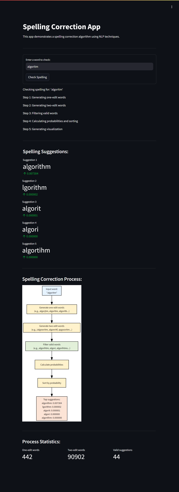

# Spelling Correction



## Project Overview

The Spelling Correction project is a natural language processing application that identifies and suggests corrections for misspelled words in input text. This project uses probabilistic models and edit distance algorithms to generate spelling suggestions. It provides a user-friendly web interface built with Streamlit, allowing users to input text and receive instant spelling correction suggestions along with additional text analysis visualizations.

This project demonstrates the application of natural language processing and machine learning in creating a practical tool for writers, editors, and anyone interested in improving text accuracy. It serves as an excellent example of an end-to-end NLP project, from text preprocessing and spelling correction to deploying a web application with multiple hosting options.

This project is inspired by various NLP projects in the field of text analysis and language processing. It aims to showcase the practical application of these techniques in a user-friendly manner.

## Table of Contents

1. [Dataset](#dataset)
2. [Model Training](#model-training)
3. [Streamlit Application](#streamlit-application)
4. [Deployment Options](#deployment-options)
5. [File Structure](#file-structure)
6. [Usage](#usage)
7. [License](#license)

## Dataset

The dataset used for training the spelling correction model is not included in the repository due to its size. The application uses pre-trained word probabilities and vocabulary stored in joblib files.

## Model Training

The spelling correction model uses probabilistic models and edit distance algorithms. The `word-probability-spellings.joblib` and `vocab-spellings.joblib` files contain the pre-trained word probabilities and vocabulary, respectively. The `Spelling_Correction.ipynb` notebook in the root directory provides details on the model training process.

## Streamlit Application

The Streamlit application is defined in `app/app.py`. It provides a user interface for inputting text and viewing the spelling correction suggestions, along with visualizations of the correction process.

## Deployment Options

There are several ways to deploy and use this application:

1. **Run Locally**:
   - Clone the repository:
     ```
     git clone https://github.com/pouryare/spelling-correction.git
     cd spelling-correction/app
     ```
   - Create a virtual environment: 
     ```
     python -m venv venv
     source venv/bin/activate  # On Windows use `venv\Scripts\activate`
     ```
   - Install requirements: `pip install -r requirements.txt`
   - Run the Streamlit app: `streamlit run app.py`
   - Open a web browser and go to `http://localhost:8501`

2. **Use Docker**:
   - Install [Docker](https://docs.docker.com/get-docker/) on your machine.
   - Pull the image from Docker Hub: 
     ```
     docker pull pouryare/spelling-correction:latest
     ```
   - Run the container: 
     ```
     docker run -p 8501:8501 pouryare/spelling-correction:latest
     ```

   Alternatively, you can build the image locally:
   - Navigate to the `app` directory
   - Build the Docker image: 
     ```
     docker build -t spelling-correction:latest .
     ```
   - Run the container: 
     ```
     docker run -p 8501:8501 spelling-correction:latest
     ```

3. **Deploy on Heroku**:
   - Create a Heroku account and install the [Heroku CLI](https://devcenter.heroku.com/articles/heroku-cli).
   - Login to Heroku: `heroku login`
   - Create a new Heroku app: `heroku create spelling-correction`
   - Add the following buildpacks:
     ```
     heroku buildpacks:add --index 1 heroku/python
     heroku buildpacks:add --index 2 https://github.com/heroku/heroku-buildpack-apt
     ```
   - Ensure that `Procfile` and `setup.sh` are in the `app/` directory before deploying.
   - Deploy the app: `git push heroku main`
   - Open the app: `heroku open`

4. **Deploy on AWS EC2**:
   - Launch an EC2 instance and SSH into it.
   - Install required dependencies:
     ```
     sudo yum update -y
     sudo yum install git python3 python3-pip -y
     ```
   - Clone the repository and navigate to the `app` directory.
   - Install the required Python packages: `pip3 install -r requirements.txt`
   - Run the Streamlit app: `streamlit run app.py`
   - Configure security groups to allow inbound traffic on port 8501.

5. **Deploy on Google Cloud Platform**:
   - Set up a [Google Cloud account](https://cloud.google.com/) and create a new project.
   - Install the [Google Cloud SDK](https://cloud.google.com/sdk/docs/install).
   - Make sure `app.yaml` is in the `app/` directory before deploying.
   - Initialize your app: `gcloud app create`
   - Deploy the app: `gcloud app deploy`
   - Access your app: `gcloud app browse`

6. **Deploy on Microsoft Azure**:
   - Set up an [Azure account](https://azure.microsoft.com/).
   - Install the [Azure CLI](https://docs.microsoft.com/en-us/cli/azure/install-azure-cli).
   - Create a resource group and app service plan.
   - Create a web app: `az webapp create --resource-group myResourceGroup --plan myAppServicePlan --name spelling-correction --runtime "PYTHON|3.7"`
   - Configure GitHub deployment: `az webapp deployment source config --name spelling-correction --resource-group myResourceGroup --repo-url https://github.com/pouryare/spelling-correction.git --branch main --manual-integration`

## File Structure
```
spelling-correction/
├── app/
│   ├── app.py
│   ├── app.yaml
│   ├── Dockerfile
│   ├── Procfile
│   ├── requirements.txt
│   ├── setup.py
│   ├── setup.sh
│   ├── vocab-spellings.joblib
│   └── word-probability-spellings.joblib
├── Spelling_Correction.ipynb
├── README.md
└── screenshot.png
```

## Usage

1. Open the application (either locally or on a deployed platform).
2. Enter your text in the input field provided.
3. Click the "Check Spelling" button to view the results.
4. Explore the spelling correction suggestions and the visualization of the correction process.

## License

This project is licensed under the MIT License. The MIT License is a permissive open-source license that allows for reuse of the software with minimal restrictions. It permits users to use, copy, modify, merge, publish, distribute, sublicense, and/or sell copies of the software, provided that the original copyright notice and permission notice are included in all copies or substantial portions of the software.

For the full license text, please refer to the [MIT License](https://opensource.org/licenses/MIT) page.

---

This project demonstrates the application of natural language processing in creating a spelling correction tool with a web application interface. It serves as an excellent example of an end-to-end NLP project with practical applications in text analysis and language processing.

The project is inspired by and builds upon various NLP projects in the fields of text mining and spelling correction. It aims to provide a practical, user-friendly implementation of these techniques for educational and practical purposes.

For any issues or suggestions, please open an issue on the [GitHub repository](https://github.com/pouryare/spelling-correction).
